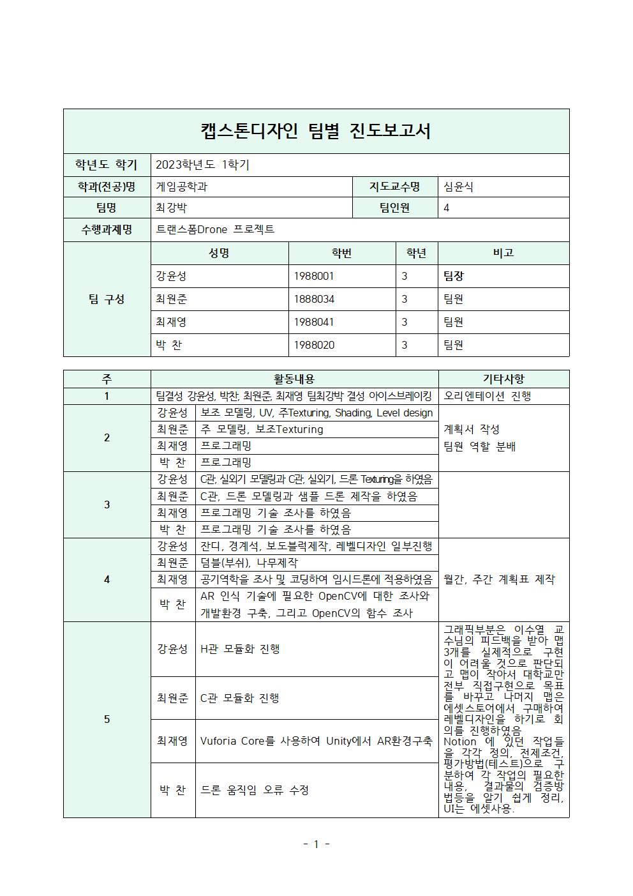
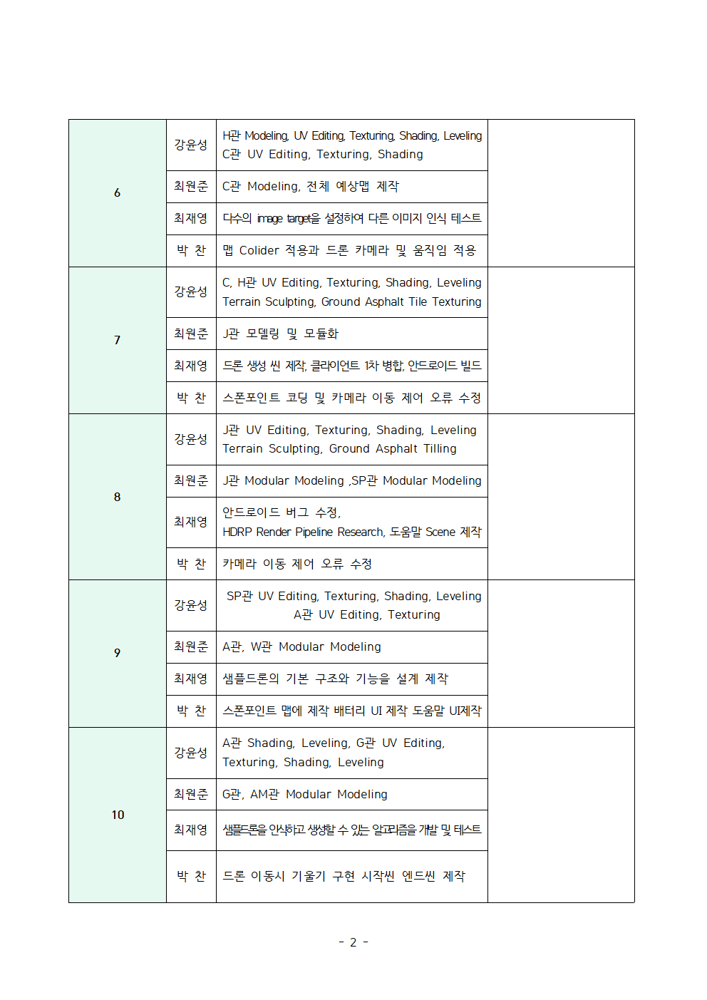
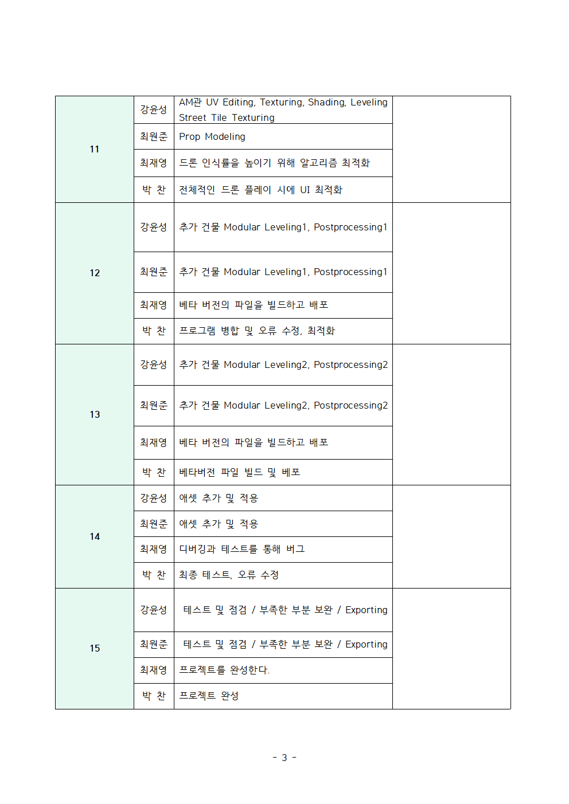

<h1>최강박 블로그 최재영</h1>

>***
># 목차
>- [목차](#목차)
>- [계획서](#계획서)
>    - [프로젝트 정보](#프로젝트-정보)
>    - [프로젝트 수행계획](#프로젝트-수행계획)
>    - [기대효과 및 활용분야](#기대효과-및-활용분야)
>- [주차별 개발 내용](#주차별-개발-내용)
>    - [진도보고서](#진도보고서)
>    - [1주차](#1주차)
>    - [2주차](#2주차)
>    - [3주차](#3주차)
>    - [4주차](#4주차)
>    - [5주차](#5주차)
>    - [6주차](#6주차)
>    - [7주차](#7주차)
>    - [8주차](#8주차)
>    - [9주차](#9주차)
>    - [10주차](#10주차)
>    - [11주차](#11주차)
>    - [12주차](#12주차)
>    - [13주차](#13주차)
>    - [14주차](#14주차)
>    - [15주차](#15주차)
>- [참고자료](#참고자료)
>***
# 계획서
[계획서](#계획서참고)
# 주차별 개발 내용
[진도보고서](#진도보고서)

<!-- | 주   | 이름                                                       | 활동내용                                                                                               |
| --- | ----------------------------------------------------------- | -------------------------------------------------------------------------------------------------- |
| 1   |공통| 팀결성 팀최강박 결성 아이스브레이킹                       | 오리엔테이션 진행                                                                                          |
||**기타사항**|오리엔테이션 진행| 
| 2   | 강윤성                                                         | 보조 모델링, UV, 주Texturing, Shading, Level design                                                      | 계획서 작성 팀원 역할 분배 |
|| 최원준 | 주 모델링, 보조Texturing                                          |
|| 최재영 | 프로그래밍                                                       |
|| 박 찬 | 프로그래밍                                                       |
||**기타사항**|계획서 작성팀원 역할 분배| 
| 3   | 강윤성                                                         | C관, 실외기 모델링과 C관, 실외기, 드론 Texturing을 |하였음                                                            |  |
|| 최원준 | C관, 드론 모델링과 샘플 드론 제작을 하였음                                   |
|| 최재영 | 프로그래밍 기술 조사를 하였음                                            |
|| 박 찬 | 프로그래밍 기술 조사를 하였음                                            |
| 4   | 강윤성                                                         | 잔디, 경계석, 보도블럭제작, 레벨디자인 |일부진행                                                                        | 월간, 주간 계획표 제작 |
|| 최원준 | 덤블(부쉬), 나무제작                                                |
|| 최재영 | 공기역학을 조사 및 코딩하여 임시드론에 적용하였음                                 |
|| 박 찬 | AR 인식 기술에 필요한 OpenCV에 대한 조사와 개발환경 구축, 그리고 OpenCV의 함수 조사  |
||**기타사항**|월간, 주간 계획표 제작|
| 5   | 강윤성                                                         | H관 모듈화 진행                                                                                          | |그래픽부분은 이수열 교수님의 피드백을 받아 맵3개를 실제적으로 구현 이 어려울 것으로 판단되고 맵이 작아서 대학교만 전부 직접구현으로 목표를 바꾸고 나머지 맵은 에셋스토어에서 구매하여 레벨디자인을 |하기로 회의를 진행하였음 Notion 에 있던 작업들을 각각 정의, 전제조건, 평가방법(테스트)으로 구분하여 각 작업의 필요한 내용, 결과물의 검증방법등을 알기 쉽게 정리, UI는 에셋사용. |
|| 최원준 | C관 모듈화 진행                                                   |
|| 최재영 | Vuforia Core를 사용하여 Unity에서 AR환경구축                           |
|| 박 찬 | 드론 움직임 오류 수정   
||**기타사항**|그래픽부분은 이수열 교수님의 피드백을 받아 맵3개를 실제적으로 구현 이 어려울 것으로 판단되고 맵이 작아서 대학교만 전부 직접구현으로 목표를 바꾸고 나머지 맵은 에셋스토어에서 구매하여 레벨디자인을 하기로 회의를 진행하였음Notion 에 있던 작업들을 각각 정의, 전제조건, 평가방법(테스트)으로 구분하여 각 작업의 필요한 내용,  결과물의 검증방법등을 알기 쉽게 정리, UI는 에셋사용.|                                             |
| 6   | 강윤성                                                         | H관 Modeling, UV Editing, Texturing, Shading, Leveling C관 UV Editing, Texturing, Shading         |  |
|| 최원준 | C관 Modeling, 전체 예상맵 제작                                      |
|| 최재영 | 다수의 image target을 설정하여 다른 이미지 인식 테스트                        |
|| 박 찬 | 맵 Colider 적용과 드론 카메라 및 움직임 적용                               |
| 7   | 강윤성                                                         | C, H관 UV Editing, Texturing, Shading, Leveling Terrain Sculpting, Ground Asphalt Tile Texturing |  |
|| 최원준 | J관 모델링 및 모듈화                                                |
|| 최재영 | 드론 생성 씬 제작, 클라이언트 1차 병합, 안드로이드 빌드                           |
|| 박 찬 | 스폰포인트 코딩 및 카메라 이동 제어 오류 수정                                  |
| 8   | 강윤성                                                         | J관 UV Editing, Texturing, Shading, Leveling Terrain Sculpting, Ground Asphalt Tilling           |  |
|| 최원준 | J관 Modular Modeling ,SP관 Modular Modeling                   |
|| 최재영 | 안드로이드 버그 수정, HDRP Render Pipeline Research, 도움말 Scene 제작 |
|| 박 찬 | 카메라 이동 제어 오류 수정                                             |
| 9   | 강윤성                                                         | SP관 UV Editing, Texturing, Shading, Leveling A관 UV Editing, Texturing                           |  |
|| 최원준 | A관, W관 Modular Modeling                                     |
|| 최재영 | 샘플드론의 기본 구조와 기능을 설계 제작                                      |
|| 박 찬 | 스폰포인트 맵에 제작 배터리 UI 제작 도움말 UI제작                              |
| 10  | 강윤성                                                         | A관 Shading, Leveling, G관 UV Editing, Texturing, Shading, Leveling                               |  |
|| 최원준 | G관, AM관 Modular Modeling                                    |
|| 최재영 | 샘플드론을 인식하고 생성할 수 있는 알고리즘을 개발 및 테스트                          |
|| 박 찬 | 드론 이동시 기울기 구현 시작씬 엔드씬 제작                                    |
| 11  | 강윤성                                                         | AM관 UV Editing, Texturing, Shading, Leveling Street Tile Texturing                              |  |
|| 최원준 | Prop Modeling                                               |
|| 최재영 | 드론 인식률을 높이기 위해 알고리즘 최적화                                     |
|| 박 찬 | 전체적인 드론 플레이 시에 UI 최적화                                       |
| 12  | 강윤성                                                         | 추가 건물 Modular Leveling1, Postprocessing1                                                           |  |
|| 최원준 | 추가 건물 Modular Leveling1, Postprocessing1                    |
|| 최재영 | 베타 버전의 파일을 빌드하고 배포                                          |
|| 박 찬 | 프로그램 병합 및 오류 수정, 최적화                                        |
| 13  | 강윤성                                                         | 추가 건물 Modular Leveling2, Postprocessing2                                                           |  |
|| 최원준 | 추가 건물 Modular Leveling2, Postprocessing2                    |
|| 최재영 | 베타 버전의 파일을 빌드하고 배포                                          |
|| 박 찬 | 베타버전 파일 빌드 및 베포                                             |
| 14  | 강윤성                                                         | 애셋 추가 및 적용                                                                                         |  |
|| 최원준 | 애셋 추가 및 적용                                                  |
|| 최재영 | 디버깅과 테스트를 통해 버그                                             |
|| 박 찬 | 최종 테스트, 오류 수정                                               |
| 15  | 강윤성                                                         | 테스트 및 점검 / 부족한 부분 보완 / |Exporting                                                                   |  |
|| 최원준 | 테스트 및 점검 / 부족한 부분 보완 / Exporting                            |
|| 최재영 | 프로젝트를 완성한다.                                                 |
|| 박 찬 | 프로젝트 완성                                                     | -->

<!-- ## 1주차 -->
<!-- ## 2주차 -->
<!-- ## 3주차 -->
<!-- ## 4주차 -->
<!-- ## 5주차 -->
<!-- ## 6주차 -->
<!-- ## 7주차 -->
<!-- ## 8주차 -->
[중간보고서](#중간보고서)
<!--  -->
<!-- ## 9주차 -->
<!-- ## 10주차 -->
<!-- ## 11주차 -->
<!-- ## 12주차 -->
<!-- ## 13주차 -->
<!-- ## 14주차 -->
<!-- ## 15주차 -->

# 참고자료
>## ▶계획서
>### 프로젝트 정보
> 
>
>### 프로젝트 수행계획
> 
> 
> 
> 
>
>## 진도보고서
> 
> 
> 
>### 기대효과 및 활용분야
> 

>## ▶중간보고서
> 
> 
> 
> 
> 
> 
> 
> 
> 
> 
> 
> 
> 
